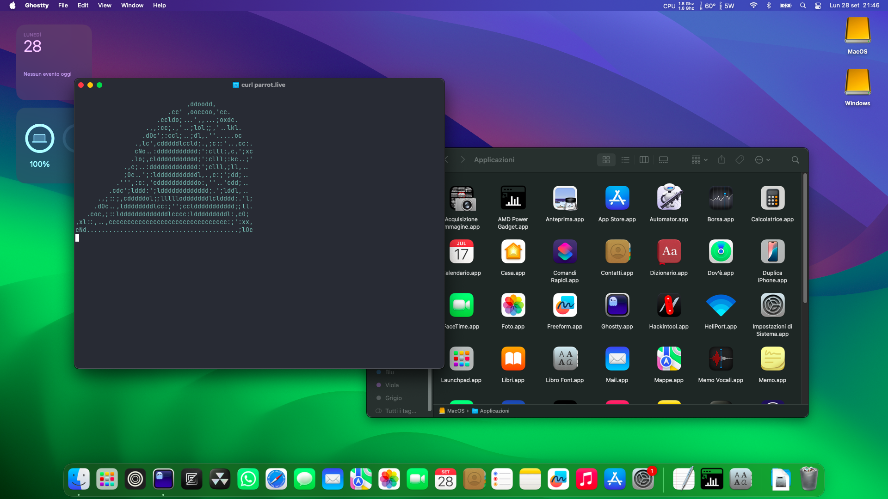

# Hackintosh configuration (with MacOS 26 Tahoe or MacOS 15 Sequoia) for the Lenovo Thinkbook 15 G3 ACL

## Screenshot

This repository contains the OC folder that allows boot and installation of a working MacOS Sequoia installation.

## Things that are not working in both MacOS Sequoia and Tahoe

- AirPort features (such as AirDrop). The `airportlwm` kext has not been updated for those features. The config is instead shipped with `itlwm`, which is much faster and stable but requires Ethernet during installation and first configuration.
WiFi works thanks to the Heliport app.

- Google Chrome browser AND any other Chromium-based browser (Vivaldi, Opera, Brave, etc) WITH GPU acceleration, together with Electron-based apps (such as Spotify and Discord) (GPU issues). Web clients of said apps work fine in Firefox-based browser. Disabling GPU acceleration should make them work (untested).

## Additional things that are not working in MacOS Tahoe

- Analog audio (AppleHDA not available anymore in MacOS Tahoe. It is suggested that you use MacOS Sequoia for this to work; otherwise, install VoodooHDA (tricky).
- Note that performance is very cut down in Tahoe because of all the Liquid Glass effects.

## Untested things

- Bluetooth in MacOS Tahoe. An NVRAM tweak was required to make it work in Sequoia and that SHOULD also do the trick for Tahoe.

## Tips

- Use the `WhateverGreen` kext for initial configuration since `NootedRed` might give white/black screens upon first setup.

## My configuration (to check if yours is good enough to go)

- Ryzen 7 5700U with Vega GPU
- WD PC SN530 (512GB) (MacOS installation disk)
- Samsung 980 (secondary disk, doesn't matter)
- 16GB RAM, 2 of those are dedicated as UMA buffer
- Intel AX200 WiFi + Bluetooth

## How to use it

1. Create your MacOS hackintosh installer using [Dortania's OpenCore install guide](https://dortania.github.io/OpenCore-Install-Guide/installer-guide/)
2. Ensure that you have MacOS Tahoe downloaded using `macrecovery.py`
3. Replace the `OC` folder in `EFI/` with the one provided in the repository.

When booting up the USB, press Space and select the USB to boot into the recovery.
Format your drives and install normally.
